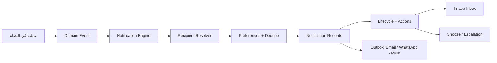

# مخطط نظام الإشعارات الاحترافي

> آخر تحديث: 2026-04-21
> الهدف: تجهيز النظام لإشعارات ذكية تفصل بين مالك المنصة، المشترك، والتنبيهات العابرة بين مشتركين.

---

## المبدأ

الإشعار ليس CRUD مستقلًا. الإشعار نتيجة حدث مهم داخل النظام.

التدفق المعتمد:

أمثلة الأحداث:

- `product.created`
- `product.price_changed`
- `inventory.low_stock`
- `user.permission_changed`
- `partnership.requested`
- `subscription.expiring_soon`

---

## تقسيم الإشعارات

### 1) إشعارات مالك المنصة

تخزن في `platform.platform_notifications`.

المستلمون:

- owner
- support
- billing
- viewer حسب الصلاحية

أمثلة:

- قرب انتهاء اشتراك مشترك خلال 30/15/7/1 يوم.
- اشتراك انتهى أو أصبح `past_due`.
- فشل إنشاء schema أو seed عند إنشاء مشترك.
- مشترك تجاوز حد المستخدمين أو التخزين أو الطلبيات.
- محاولة دخول لمشترك موقوف.
- طلب ربط جديد بين مشتركين يحتاج متابعة أو مراقبة.

### 2) إشعارات داخل المشترك

تخزن داخل schema المشترك في `notifications` و `notification_recipients`.

المستلمون:

- مستخدم محدد.
- دور محدد مثل المدير أو أمين المخزن.
- كل من لديه permission مثل `manage_products`.
- صاحب العملية أو المسؤول عنها.

أمثلة:

- إضافة صنف جديد.
- تغيير سعر صنف.
- انخفاض أو نفاد المخزون.
- طلبية جديدة أو مؤكدة أو مرفوضة.
- استلام دفعة.
- فشل توليد قيد محاسبي تلقائي.
- تعديل صلاحيات مستخدم أو تعطيله.

### 3) إشعارات بين مشتركين

الحدث المرجعي يخزن في `platform` لأن العلاقة بين المشتركين موجودة في `platform.tenant_partnerships`.

القراءة للمستخدمين تتم بطريقتين مقبولتين:

- عرض مدمج من API يقرأ من `platform` ومن schema المشترك الحالي.
- أو نسخ إشعار محلي داخل schema كل طرف مع `platform_notification_id` و `correlation_id`.

أمثلة:

- مشترك طلب ربط من مشترك آخر.
- الطرف الآخر وافق أو رفض.
- صلاحيات الربط تغيرت.
- مشاركة المخزون توقفت.
- طلب شراء عند مشترك تحول إلى طلب بيع عند الشريك.

---

## قواعد المحرك

- `notification_types.code` هو الكود الرسمي مثل `inventory.low_stock`.
- `notification_rules.trigger_event` يربط الحدث بنوع الإشعار.
- `target_json` يحدد المستلمين: users, roles, permissions, dynamic owner.
- `recipient_reason` يشرح لماذا وصل الإشعار لهذا المستخدم.
- `dedupe_key` يمنع تكرار نفس التنبيه خلال نافذة قصيرة.
- `group_key` يجمع إشعارات كثيرة في تنبيه واحد مثل "5 أصناف انخفض مخزونها".
- `severity` تتحكم في اللون، الأولوية، وإمكانية الكتم.
- `action_url` يفتح الشاشة الصحيحة مباشرة.
- `default_actions_json` يحدد أفعالًا مباشرة مثل قبول، رفض، مراجعة، تذكيري لاحقًا.
- `payload_json` يحمل بيانات خفيفة للعرض، وليس نسخة كاملة من الكيان.
- `correlation_id` يربط الإشعارات الناتجة عن نفس العملية عبر platform و tenant schemas.

---

## دورة حياة الإشعار

الحالة الأساسية تكون لكل مستلم، لأن إشعارًا واحدًا قد يصل لعدة مستخدمين:

- `new`: ظهر للمستخدم ولم يسلم بعد على قناة مؤكدة.
- `delivered`: وصل داخل التطبيق أو قناة خارجية.
- `read`: فتحه المستخدم أو علمه كمقروء.
- `snoozed`: مؤجل إلى وقت محدد.
- `actioned`: نفذ المستخدم إجراءً مثل قبول أو مراجعة.
- `archived`: أخفاه المستخدم من صندوقه.
- `expired`: انتهت صلاحيته ولم يعد قابلًا للإجراء.

القاعدة: قراءة الإشعار لا تعني حل المشكلة. الحل يسجل في `notification_actions` أو بتغيير حالة الكيان الأصلي.

---

## لماذا وصلني؟

كل إشعار يجب أن يعرض سبب وصوله للمستخدم، مثال:

- لأنك تملك صلاحية `manage_products`.
- لأنك مدير المخزون في هذا المخزن.
- لأنك صاحب الطلبية.
- لأنك طرف في طلب الربط.
- لأنك مالك المنصة أو مسؤول الفوترة.

هذا السبب يخزن بعد حل المستلمين في `recipient_reason` حتى لا يتغير إذا تغيرت الصلاحيات لاحقًا.

---

## الإجراءات المباشرة

الإشعار القابل للإجراء لا يكتفي بزر فتح. أمثلة الأفعال:

- فتح الصنف.
- مراجعة المخزون.
- إنشاء أمر شراء.
- قبول طلب ربط.
- رفض طلب ربط.
- فتح إعدادات الحسابات الناقصة.
- تجديد اشتراك.
- تذكيري لاحقًا.
- تجاهل.

كل إجراء يسجل في `notification_actions` مع المستخدم والوقت والنتيجة.

---

## التجميع الذكي

يستخدم `group_key` و `dedupe_key` لتقليل الضجيج:

- بدل 20 إشعارًا: "20 صنفًا تحت حد التنبيه".
- بدل 5 تغييرات سعر: "5 أسعار تغيرت اليوم".
- بدل عدة محاولات دخول: "8 محاولات دخول فاشلة خلال ساعة".

التجميع لا يضيع التفاصيل؛ تفتح بطاقة التجميع قائمة العناصر المرتبطة.

---

## Snooze والتصعيد

يدعم النظام `snoozed_until` للتنبيهات التي تحتاج إجراء لاحقًا:

- بعد ساعة.
- نهاية اليوم.
- غدًا.
- قبل انتهاء الاشتراك بثلاثة أيام.

التصعيد يحدث عند عدم المعالجة:

- نقص مخزون حرج لم يقرأ خلال ساعتين يصعد للمدير.
- طلب ربط لم يعالج خلال 3 أيام يصعد لمسؤول الشركة أو مالك المنصة.
- فشل قيد محاسبي لم يعالج يصعد للمحاسب الرئيسي.
- اشتراك قرب الانتهاء ولم يتم التجديد يصعد للمالك وفريق الفوترة.

---

## قواعد حسب الدومين

### المخزون

- حد التنبيه يمكن أن يكون لكل صنف ولكل مخزن.
- دعم `low_stock_threshold` و `out_of_stock`.
- الصنف سريع الحركة يمكن أن يملك نافذة تنبيه أقصر.
- لا يرسل تنبيه نقص مخزون جديد لنفس الصنف والمخزن قبل انتهاء نافذة `dedupe_window_minutes`.

### الأسعار

- إشعار السعر يعرض السعر القديم والجديد ونسبة التغيير.
- يمكن إرسال التنبيه للبائعين أو المديرين أو الشركاء حسب الصلاحيات.
- إذا تغير السعر بنسبة كبيرة، يمكن جعل الإشعار `action_required`.
- لا تظهر أسعار الشريك إلا إذا سمحت علاقة الربط بذلك.

### الشركاء بين المشتركين

- طلب ربط جديد.
- قبول أو رفض طلب الربط.
- تغيير صلاحيات الربط.
- إلغاء الربط.
- محاولة وصول غير مسموحة.
- تغيير سعر أو مخزون صنف مشترك ضمن صلاحيات الربط.
- تحويل طلب شراء إلى طلب بيع عند الشريك.

### المحاسبة

- فشل توليد قيد تلقائي.
- حساب ربط ناقص في `accounting_settings`.
- فترة محاسبية أغلقت.
- اختلاف بين حساب رقابي وتفصيل sub-ledger.

---

## أدوار الاستلام

لا تعتمد الإشعارات على المستخدم الفردي فقط:

- المدير يرى الحرجة والأمان والصلاحيات.
- أمين المخزن يرى تنبيهات المخزون.
- المحاسب يرى القيود، المدفوعات، الضرائب، والمطابقة.
- البائع يرى طلبياته وتغييرات الأصناف المسموحة له.
- مالك المنصة يرى الاشتراكات والمشتركين وفشل التهيئة.

هذه القواعد توثق في `notification_rules.target_json`.

---

## الشدة والقنوات

الشدة:

- `info`
- `success`
- `warning`
- `critical`
- `action_required`

القنوات:

- `in_app` في المرحلة الأولى.
- `email` لاحقًا للتنبيهات المهمة.
- `whatsapp` لاحقًا حسب إعدادات المشترك.
- `push` إذا تمت إضافة تطبيق موبايل.

الأمان والصلاحيات:

- إشعارات `security.*` و `user.permission_changed` لا يستطيع المستخدم العادي كتمها.
- يمكن للمدير تحديد القناة، لكن لا يحذف الإشعار القانوني من audit log.

---

## القوالب واللغة

كل نوع إشعار يحتاج قوالب قابلة للترجمة:

- عنوان كامل.
- عنوان مختصر للـ Navbar.
- نص تفصيلي.
- سبب الوصول.
- قالب خاص بالبريد أو WhatsApp لاحقًا.

المتغيرات تكون صريحة مثل:

- `{product_name}`
- `{old_price}`
- `{new_price}`
- `{stock_qty}`
- `{tenant_name}`
- `{subscription_renews_at}`

---

## الخصوصية و Audit

- إشعار inter-tenant لا يكشف بيانات شركة أخرى إلا ضمن صلاحيات `tenant_partnerships`.
- لا يظهر مستخدم داخلي من شركة أخرى إلا إذا كان العرض مسموحًا.
- الإشعار ليس بديلًا عن audit log.
- أرشفة أو حذف الإشعار لا يحذف سجل التدقيق.
- إشعارات الأمان والصلاحيات يجب أن ترتبط دائمًا بسجل audit.

---

## الاحتفاظ والتنظيف

سياسات مقترحة:

- الإشعارات العادية: 90 إلى 180 يومًا.
- إشعارات الأمان والصلاحيات: مدة أطول حسب سياسة الشركة.
- outbox الناجح ينظف بعد 30 يومًا.
- الإشعارات المؤرشفة يمكن تنظيفها بعد مدة.
- `is_legal_hold` يمنع الحذف التلقائي عند وجود حاجة قانونية.

---

## مقاييس مفيدة

للمشترك:

- غير مقروء.
- حرج.
- يحتاج إجراء.
- مؤجل.
- تم تصعيده.

لمالك المنصة:

- اشتراكات قريبة الانتهاء.
- إشعارات لم تعالج.
- فشل provisioning.
- طلبات ربط معلقة.
- مشتركون لديهم إشعارات حرجة متكررة.

---

## صفحات الواجهة

### `/notifications`

مركز إشعارات المستخدم داخل المشترك:

- فلاتر: الكل، غير مقروء، مهمة، تحتاج إجراء.
- تصنيف حسب category.
- زر تعليم كمقروء.
- فتح action_url.
- إظهار مصدر الإشعار: صنف، طلبية، مستخدم، شريك، محاسبة.
- عرض "لماذا وصلني هذا؟".
- أزرار الإجراء المباشر.
- زر تذكيري لاحقًا.
- شارة للحالة: جديد، مقروء، مؤجل، تم إجراءه، مصعد.

### `/notifications/preferences`

تفضيلات المستخدم:

- تفعيل أو إيقاف حسب النوع والقناة.
- نمط التجميع: فوري، كل ساعة، يومي، مكتوم.
- حد أدنى للشدة.
- ساعات هدوء.
- إشعارات الأمان تظهر مقفلة عند عدم السماح بكتمها.
- تفضيلات حسب الدور أو الصلاحية عند المدير.

### `/owner/notifications`

مركز إشعارات مالك المنصة:

- اشتراكات قريبة الانتهاء.
- فشل provisioning.
- تجاوز حدود الخطط.
- طلبات ربط بين مشتركين.
- محاولات دخول لمشتركين موقوفين.
- مؤشرات إشعارات غير معالجة ومصعدة.

### Navbar

- badge بعدد غير المقروء.
- قائمة مختصرة لآخر 5 إشعارات.
- زر "عرض الكل".
- أولوية عرض `critical` و `action_required`.

---

## API المقترح

Tenant API:

- `GET /api/v1/notifications`
- `GET /api/v1/notifications/unread-count`
- `POST /api/v1/notifications/{publicId}/read`
- `POST /api/v1/notifications/read-all`
- `POST /api/v1/notifications/{publicId}/archive`
- `POST /api/v1/notifications/{publicId}/snooze`
- `POST /api/v1/notifications/{publicId}/actions/{actionCode}`
- `GET /api/v1/notification-preferences`
- `PUT /api/v1/notification-preferences`

Owner API:

- `GET /api/v1/platform/notifications`
- `GET /api/v1/platform/notifications/unread-count`
- `POST /api/v1/platform/notifications/{publicId}/read`
- `POST /api/v1/platform/notifications/{publicId}/actions/{actionCode}`

Event/internal API:

- `NotificationService.handleDomainEvent(event)`
- `RecipientResolver.resolve(event, rule)`
- `NotificationEscalationWorker.escalateDueNotifications()`
- `NotificationOutboxWorker.deliverPending()`
- `NotificationRetentionWorker.cleanupExpiredNotifications()`

---

## أولويات التنفيذ

1. إنشاء جداول `notification_types`, `notifications`, `notification_recipients`, `notification_templates`, `notification_actions`, `notification_escalations`, `notification_preferences`, `notification_rules`, `notification_retention_policies`, `notification_outbox`.
2. Seed لأنواع الإشعارات الأساسية.
3. ربط الأحداث الأولى: تغيير السعر، إضافة صنف، انخفاض المخزون، تعديل صلاحيات، طلب ربط، قرب انتهاء اشتراك.
4. بناء مركز الإشعارات داخل المشترك.
5. بناء مركز إشعارات المالك.
6. إضافة outbox للتسليم الخارجي لاحقًا.

---

## قرار مهم

لا تستخدم جدولًا واحدًا بسيطًا فيه `user_id` و `is_read` فقط. هذا التصميم يفشل في SaaS لأن:

- الإشعار الواحد قد يذهب لعدة مستخدمين.
- حالة القراءة تختلف من مستخدم لآخر.
- بعض الإشعارات تخص مالك المنصة وليس tenant.
- طلبات الربط تخص مشتركين مختلفين.
- القنوات والتفضيلات تختلف حسب المستخدم والنوع والشدة.
