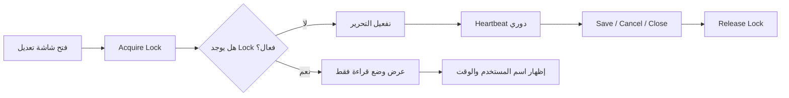

# مخطط قفل التحرير ومنع التعديل المتزامن

> آخر تحديث: 2026-04-21
> الهدف: منع مستخدمين من تعديل نفس السجل في نفس اللحظة، مع إبقاء السجل قابلًا للعرض.

---

## الفكرة

هذا ليس قفل قاعدة بيانات طويل داخل transaction. هذا قفل تطبيقي قصير العمر يدار من الباكند.

عند دخول مستخدم إلى شاشة تعديل كيان حساس، يحاول النظام إنشاء lock:

القفل يجب أن يملك انتهاء تلقائيًا إذا أغلق المستخدم المتصفح أو انقطع الاتصال.

---

## السلوك المطلوب في الواجهة

إذا دخل مستخدم آخر إلى نفس السجل:

- يرى رسالة واضحة: "المستخدم فلان يعمل الآن على هذه الطلبية".
- يرى وقت بداية التحرير وآخر نشاط.
- يستطيع العرض فقط.
- أزرار الحفظ والتعديل والتأكيد تكون معطلة حسب السياسة.
- يمكن للمدير استخدام "تولي التحرير" إذا كان مسموحًا.
- عند انتهاء القفل أو تحريره، تظهر إمكانية إعادة المحاولة.

الرسالة لا يجب أن تمنع القراءة. المنع يكون على العمليات التي تغير البيانات.

---

## أين يطبق

### المبيعات

- تعديل طلبية بيع.
- مراجعة طلبية تحت الإدارة.
- تأكيد أو رفض طلبية.
- تعديل كميات سطور الطلبية.
- تحويل طلبية إلى فاتورة طريق.
- إنشاء مرتجع مرتبط بطلبية.

### المشتريات

- تعديل أمر شراء.
- تأكيد أمر شراء.
- تسجيل استلام البضاعة.
- ربط فاتورة مورد.
- تسجيل دفعة مورد إذا كانت مرتبطة بنفس أمر الشراء.

### المخزون

- تسوية مخزون.
- جرد مخزن.
- تحويل بين مخازن.
- تعديل حد تنبيه صنف داخل مخزن.
- تعديل كمية افتتاحية أو تصحيح تكلفة.

### الأصناف والأسعار

- تعديل بيانات صنف.
- تغيير السعر.
- تغيير تكلفة الشراء.
- تعديل ربط الحسابات المحاسبية للصنف.

### المحاسبة

- تعديل قيد يدوي.
- ترحيل قيد.
- عكس قيد.
- إقفال فترة أو سنة مالية.
- تعديل opening balances.
- تغيير إعدادات الحسابات والضرائب.

### المستخدمون والصلاحيات

- تعديل صلاحيات مستخدم.
- تعديل دور.
- تعطيل مستخدم.

### شبكة الشركاء

- قبول أو رفض طلب ربط.
- تغيير صلاحيات الربط.
- إلغاء الربط.

### المنصة

- تعديل خطة اشتراك.
- تغيير حالة مشترك.
- تجديد أو إيقاف اشتراك.
- إعادة محاولة provisioning.

---

## أنواع القفل

- `edit`: تعديل بيانات.
- `approve`: تأكيد أو اعتماد.
- `post`: ترحيل محاسبي أو مخزني.
- `close`: إقفال فترة أو سنة.
- `reconcile`: مطابقة حسابية أو بنكية.
- `provision`: تهيئة مشترك أو إعادة محاولة.

يمكن لعدة مستخدمين عرض السجل، لكن لا يمكن لأكثر من مستخدم امتلاك lock لنفس `resource_type + resource_id + lock_scope`.

---

## مدة القفل والـ heartbeat

القيم المقترحة:

- مدة القفل الافتراضية: 5 دقائق.
- Heartbeat كل 30 ثانية أثناء بقاء شاشة التعديل مفتوحة.
- إذا لم يصل heartbeat خلال 90 ثانية، يصبح القفل قابلًا للانتهاء.
- عند الحفظ أو الإلغاء أو مغادرة الصفحة، يرسل الفرونت release.
- Job خلفي ينهي الأقفال المنتهية.

---

## API المقترح

Tenant API:

- `POST /api/v1/resource-locks/acquire`
- `POST /api/v1/resource-locks/{publicId}/heartbeat`
- `POST /api/v1/resource-locks/{publicId}/release`
- `POST /api/v1/resource-locks/{publicId}/take-over`
- `GET /api/v1/resource-locks/status?resourceType=orders&resourceId=...&scope=edit`

Platform API:

- `POST /api/v1/platform/resource-locks/acquire`
- `POST /api/v1/platform/resource-locks/{publicId}/heartbeat`
- `POST /api/v1/platform/resource-locks/{publicId}/release`
- `POST /api/v1/platform/resource-locks/{publicId}/take-over`

---

## قواعد مهمة

- لا يقبل أي endpoint حساس تعديلًا بدون `lock_token` صالح إذا كانت السياسة تتطلب lock.
- القفل لا يغني عن `version` أو `updated_at` عند الحفظ. عند الحفظ يجب التحقق أن السجل لم يتغير بعد فتحه.
- القفل يسجل في audit log عند الإنشاء، التحرير، الانتهاء، أو التولي القسري.
- التولي القسري يحتاج صلاحية واضحة مثل `locks.take_over`.
- عند التولي القسري، يرسل النظام إشعارًا للمستخدم الأول.
- إذا كان القفل على عملية محاسبية أو إقفال سنة، يجب منع التولي إلا من صلاحية عليا.

---

## تصميم الرسائل

أمثلة:

- "محمد سعيد يحرر هذه الطلبية منذ 3 دقائق. يمكنك العرض فقط."
- "أمر الشراء قيد الاستلام من طرف أمين المخزن."
- "القيد اليدوي مفتوح لدى المحاسب سمير. آخر نشاط منذ 40 ثانية."
- "يمكنك طلب التولي لأن القفل لم يحدث heartbeat منذ دقيقتين."

---

## علاقة القفل بالإشعارات

القفل ليس إشعارًا دائمًا. لكن بعض الأحداث تولد إشعارًا:

- تولي قسري من مدير.
- انتهاء قفل على عملية مهمة بدون حفظ.
- محاولة مستخدم تعديل سجل مقفل عدة مرات.
- قفل بقي نشطًا مدة طويلة على عملية حرجة.

---

## الواجهة المطلوبة

مكونات واجهة مشتركة:

- `ResourceLockBanner`: يظهر من يحرر السجل.
- `useResourceLock`: hook لاحقًا لإدارة acquire/heartbeat/release.
- `LockedActionButton`: زر يعطل نفسه ويعرض سبب التعطيل.

أماكن العرض:

- صفحة تفاصيل طلبية البيع.
- صفحة تعديل أمر الشراء.
- صفحة استلام أمر الشراء.
- صفحة القيود اليدوية.
- صفحة إعدادات المحاسبة.
- صفحة تعديل الصنف والسعر.
- صفحة صلاحيات المستخدم.
- صفحة طلبات الربط بين المشتركين.

---

## القرار

يجب اعتماد قفل تطبيقي قصير العمر مع heartbeat، وليس الاعتماد على أن المستخدم "لن يفتح نفس الصفحة". هذا مهم لأن النظام يحتوي عمليات مالية ومخزنية ومحاسبية لا تحتمل تعديلين متزامنين على نفس السجل.
